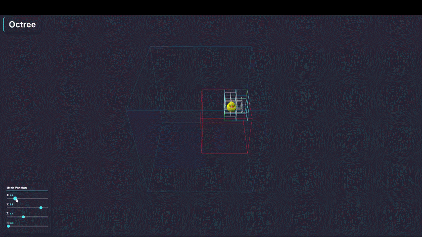

# Octree

A lightweight visualizer for an Octree spatial querying system. [View the visualizer here](https://suryashch.github.io/octree/).

---
## What is an Octree?

An Octree is a data structure is used for efficient spatial querying and is created by recursively dividing a 3D space into 8 cubes. These 8 cubes can be thought of as children of a parent node, and each also contain 8 children of their own.

Actions like clash detection, nearest neighbor calculation and raycasting break down when the number of objects in the scene becomes too large. An octree speeds this up by pruning entire areas of the scene, reducing the total number of calculations which need to be done. [The accompanying write-up](./reports/octree.md) explains this in-depth.

Octrees are used widely in Game Development, Clash Detection, K-Nearest Neighbors Algorithms and many other fields.

This demo serves to educate on the mechanics behind how an Octree works, and is intended to be a lightweight implementation that could potentially sit as a layer within larger 3D scenes.

---
## Credits

[Classic-Roblox-Rubber-Duckie](https://sketchfab.com/3d-models/classic-roblox-rubber-duckie-67cb58f5ed1e4a8cabcf81723c619a17) by fog. CC License.

